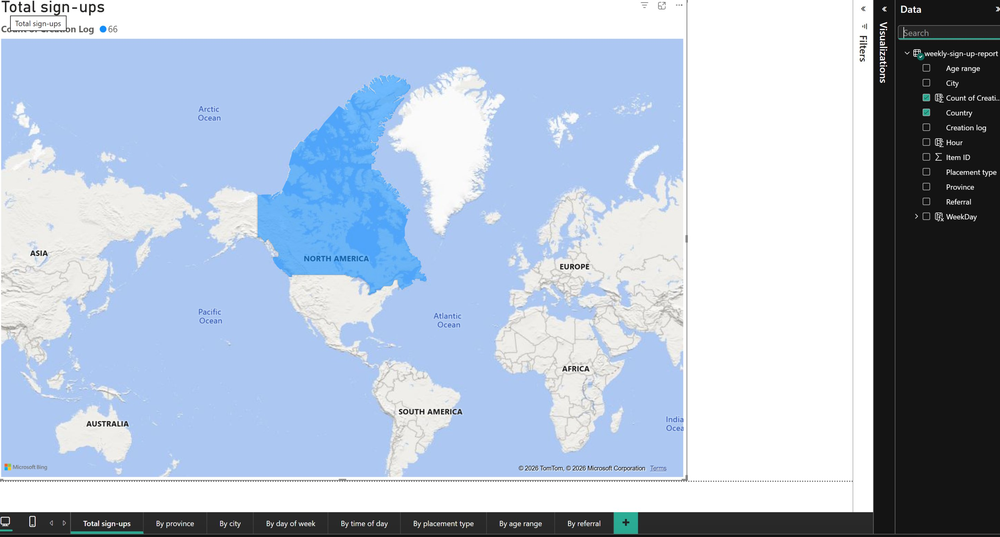
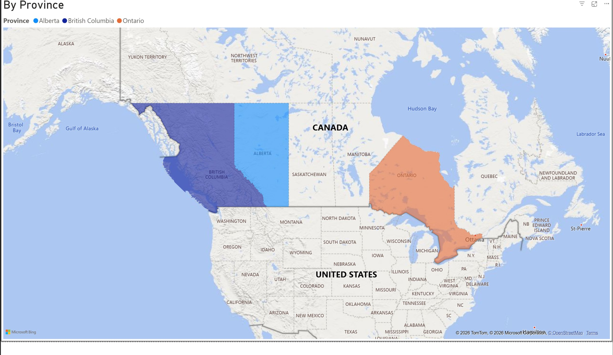
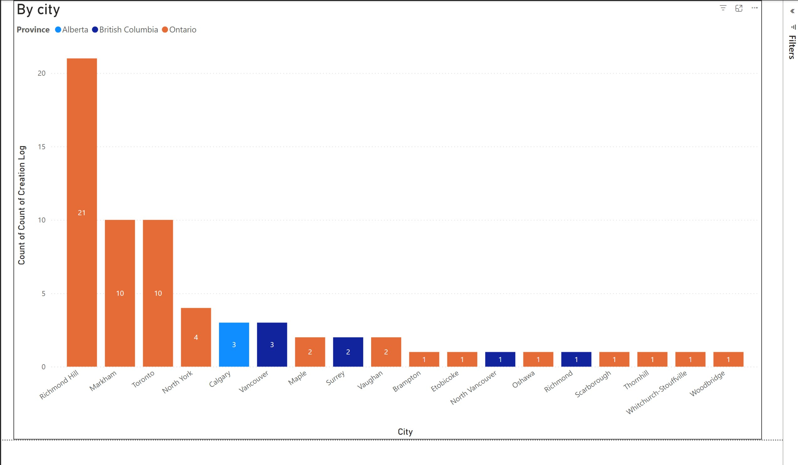
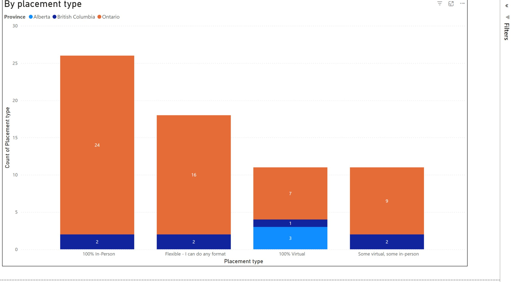
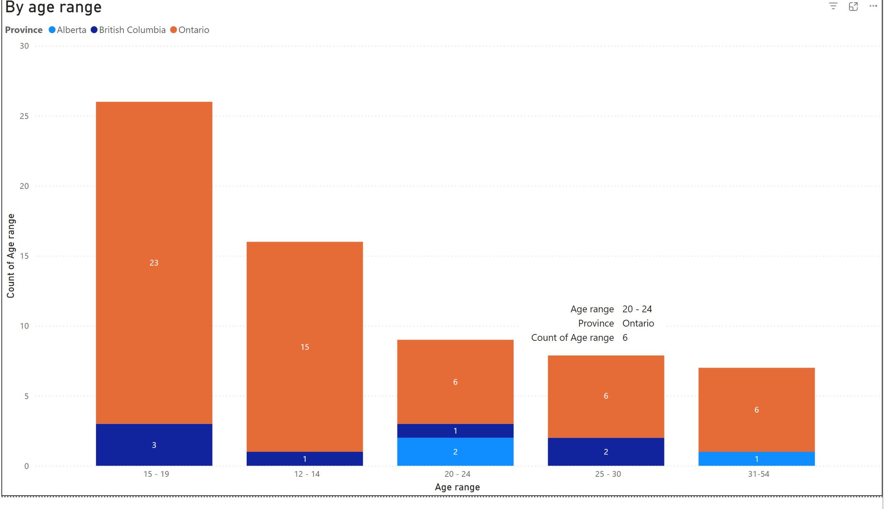
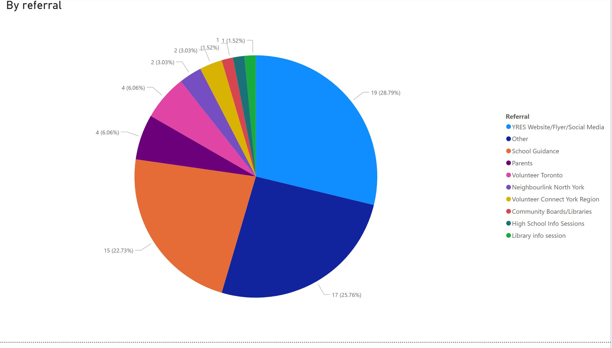

# YRES Weekly Signup Report — Power BI

> Power BI dashboard analyzing weekly volunteer signups for YRES, with DAX calculated columns for time-based segmentation and stacked column charts for province-level breakdowns.

**Part of a [multi-tool case study](../).**

---

## Why Power BI for this project

After earning my **Microsoft PL-300 certification**, I rebuilt the YRES signup analysis in Power BI to apply my certified skills to real-world data. Where Tableau is the team's primary delivery tool, this Power BI implementation is a self-directed extension — using the same source data (with permission) to demonstrate end-to-end Power BI workflow: data ingestion, DAX calculated columns, multi-page report design, and Bing Maps integration.

---

## Business questions

1. **Geographic reach** — Where do YRES volunteers come from at country, province, and city level?
2. **Timing patterns** — When during the week and day do signups happen?
3. **Demographics** — What age ranges does YRES attract?
4. **Placement preferences** — Do volunteers prefer in-person, virtual, or flexible formats?
5. **Referral channels** — Which sources bring the most signups (School Guidance, YRES Website, partner organizations)?

---

## Approach

Built end-to-end in Power BI Desktop:

- **Data ingestion** — Calendly weekly export loaded via Excel into Power BI
- **DAX measure** for the core signup count:

```dax
Count of Creation Log = COUNT('weekly-sign-up-report'[Creation log])
```

The base measure counting non-blank signup records — used across all visuals as the primary metric.

- **DAX calculated columns** for time-based segmentation:

```dax
WeekDay = 
DATE(
    YEAR('weekly-sign-up-report'[Creation log]),
    MONTH('weekly-sign-up-report'[Creation log]),
    DAY('weekly-sign-up-report'[Creation log])
)
- WEEKDAY('weekly-sign-up-report'[Creation log], 1) + 1
```

Returns the week-start date (Sunday) for each record, allowing aggregation across weeks regardless of when individual signups occurred.

```dax
Hour = HOUR('weekly-sign-up-report'[Creation log])
```

Extracts the hour-of-day component from the signup timestamp, enabling time-of-day analysis.

- **Multi-page report architecture** — seven analytical views (Total sign-ups, By province, By city, By day of week, By time of day, By placement type, By age range, By referral) navigable via Power BI page tabs
- **Bing Maps integration** — country and province visualization with color-coded provinces (Alberta light blue, BC dark blue, Ontario orange)
- **Consistent province color encoding** across all charts for visual continuity

---

## Techniques demonstrated

- **DAX measures** — base aggregation logic with COUNT
- **DAX calculated columns** — date logic (week-start derivation) and time extraction (HOUR)
- **Power Query** — Excel data ingestion and column type configuration
- **Multi-page report design** — seven coordinated analytical views in one .pbix
- **Geographic visualization** — Bing Maps with custom province color coding
- **Stacked column charts** — showing totals plus province-level breakdown in a single view
- **Pie chart segmentation** — for referral source analysis

---

## Screenshots

### Total sign-ups — geographic overview



### By Province — Canadian breakdown

Color-coded provinces show the three regions YRES actively recruits from: Ontario (orange, majority of signups), British Columbia (dark blue), and Alberta (light blue).



### By City

Stacked column chart showing top cities with province color-coding. Richmond Hill, Markham, and Toronto lead in Ontario; Vancouver and Surrey in BC; Calgary in Alberta.



### By Placement Type

Most volunteers prefer 100% In-Person placements, followed by Flexible (any format). Pure 100% Virtual is the smallest segment.



### By Age Range

Younger volunteers dominate signups — the 15-19 age group is the largest by far, followed by 12-14. This informs recruitment messaging.



### By Referral Source

YRES Website / Flyer / Social Media leads at 28.79%, followed closely by "Other" (25.76%) and School Guidance (22.73%). These three channels together account for over 75% of signups.



---

## Tools

Power BI Desktop · DAX · Power Query · Bing Maps · Excel

---

## Data and privacy

Built on YRES data with permission to publish. No participant names, contact information, or identifying details are visible in any visualization. The `.pbix` source file is not published here — only visual representations of the analysis. Live `.pbix` walkthrough available on request during interviews.

---

**Author:** Viktoriia Kapkanets — Microsoft Certified Power BI Data Analyst (PL-300)
**Portfolio:** [GitHub](https://github.com/Viktoriia-Kapkanets) · [Tableau Public](https://public.tableau.com/app/profile/viktoriia.kapkanets) · [LinkedIn](https://www.linkedin.com/in/viktoriia-kapkanets/)
