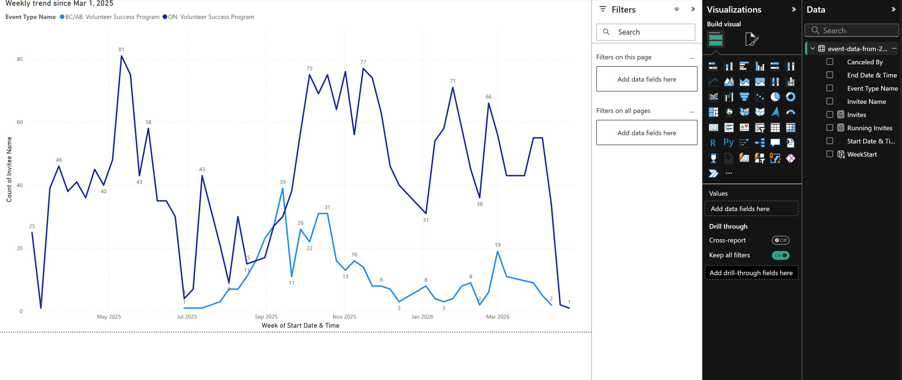
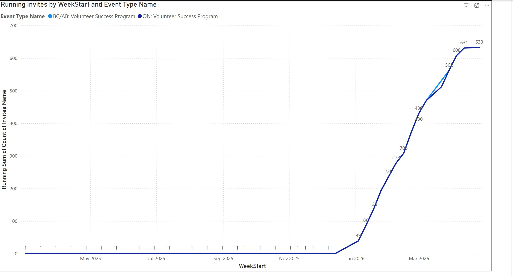
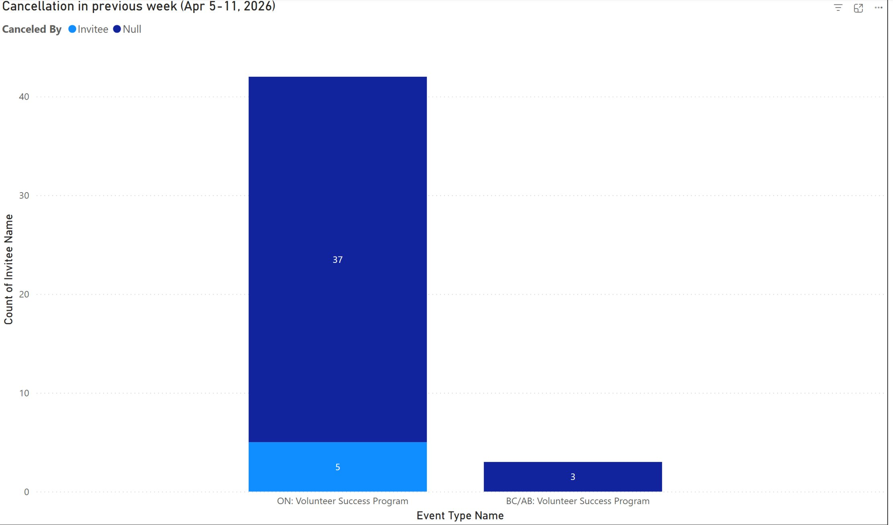
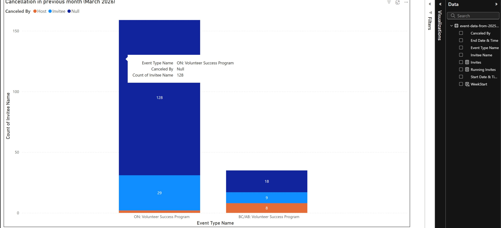
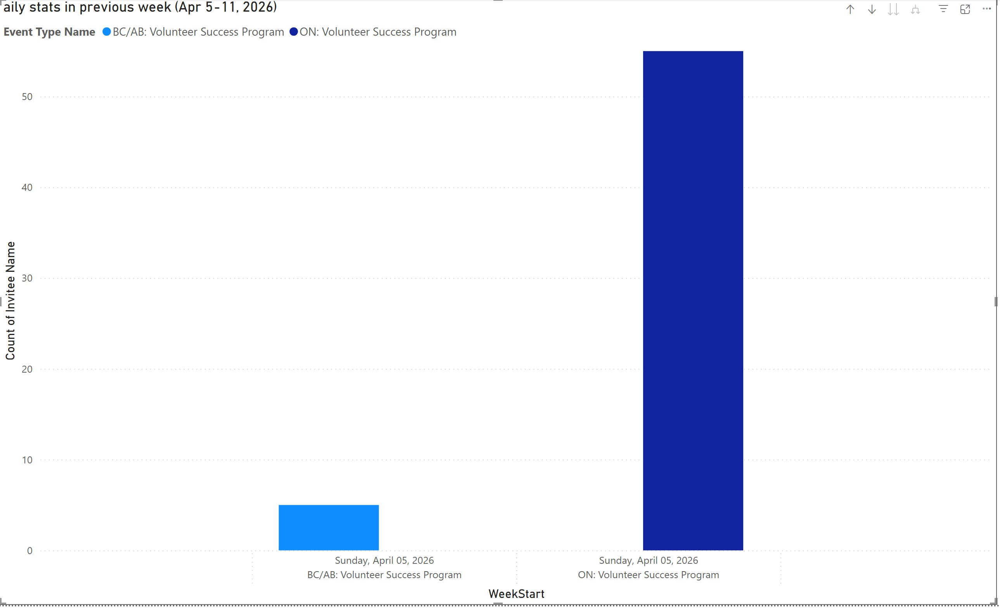
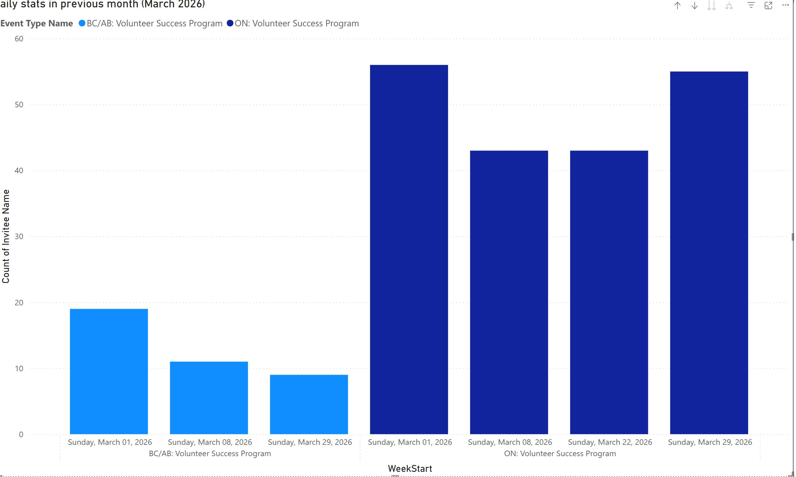

# YRES 1:1 Coaching Engagement Report — Power BI

> Power BI dashboard analyzing 1:1 coaching engagement across YRES's BC/AB and ON Volunteer Success Programs, with running totals, weekly trends, and cancellation analysis spanning over a year of data (March 2025 onward).

**Part of a [multi-tool case study](../).**

---

## Why Power BI for this project

After earning my **Microsoft PL-300 certification**, I rebuilt the YRES coaching engagement analysis in Power BI to apply my certified skills — particularly **DAX measures** — to real-world data spanning a 13-month period. This implementation is a self-directed extension using YRES data with permission, focused on demonstrating end-to-end Power BI workflow: data ingestion from Calendly exports, DAX measure authoring (DISTINCTCOUNT, CALCULATE, ALLSELECTED), running total calculation, calculated columns for time bucketing, and multi-visual report design for cross-program comparison.

---

## Business questions

1. **Engagement trajectory** — How is 1:1 coaching uptake trending week over week across BC/AB and ON Volunteer Success Programs?
2. **Cumulative reach** — What's the running total of unique invitees engaged since program launch?
3. **Cancellation patterns** — Where are cancellations clustering — by week, by month, and by canceler type (Invitee vs Host vs Null)?
4. **Daily activity** — How does session activity vary across days within recent reporting periods?

---

## Approach

Built end-to-end in Power BI Desktop on a 13-month dataset (Mar 1, 2025 – Apr 2026):

### DAX measures

```dax
Invites = DISTINCTCOUNT('event-data-from-20250301-to-202'[Invitee Name])
```

Base measure counting **unique** invitees. DISTINCTCOUNT avoids double-counting volunteers who book multiple sessions, giving an accurate reach metric.

```dax
Running Invites = 
CALCULATE(
    [Invites],
    FILTER(
        ALLSELECTED('event-data-from-20250301-to-202'),
        'event-data-from-20250301-to-202'[WeekStart] <= MAX('event-data-from-20250301-to-202'[WeekStart])
    )
)
```

Running total of unique invitees by week — implemented with `CALCULATE` + `FILTER` + `ALLSELECTED` so the cumulative sum respects any slicers applied on the page while still aggregating across all weeks up to and including the current one. This pattern is essential for cumulative trend visualizations and is one of the most common interview questions for Power BI roles.

### DAX calculated column

```dax
WeekStart = 
DATE(
    YEAR('event-data-from-20250301-to-202'[Start Date & Time]),
    MONTH('event-data-from-20250301-to-202'[Start Date & Time]),
    DAY('event-data-from-20250301-to-202'[Start Date & Time])
)
- WEEKDAY('event-data-from-20250301-to-202'[Start Date & Time], 1) + 1
```

Computes the Sunday-start date of the week for each session record. This becomes the time axis for weekly trend, running total, and weekly comparison visuals, allowing aggregation regardless of when individual sessions occurred within a week.

### Report design

- **Multi-visual report** — six analytical views: weekly trend, running invites, cancellation by previous week, cancellation by previous month, daily stats by previous week, daily stats by previous month
- **Two program comparison** — BC/AB and ON Volunteer Success Programs shown side-by-side with consistent color encoding (BC/AB light blue, ON dark blue) across every visual
- **Time-period framing** — separate "previous week" and "previous month" visuals provide both immediate and contextual perspectives for coordinators
- **Cancellation segmentation** — stacked breakdown by canceler type (Invitee, Host, Null) reveals whether dropouts are volunteer-driven or system-driven

---

## Techniques demonstrated

- **DISTINCTCOUNT** — accurate unique-volunteer counting (avoids inflated metrics from repeat bookings)
- **Running total with CALCULATE + ALLSELECTED + FILTER** — cumulative aggregation pattern that respects user slicers
- **Calculated columns for date logic** — Sunday-start week derivation for consistent weekly time-axis
- **Multi-visual report design** — six coordinated views in a single .pbix
- **Stacked column charts** — segmenting cancellations by canceler type to surface dropout patterns
- **Cross-program comparison** — visual parallelism between BC/AB and ON Volunteer Success Programs

---

## Screenshots

### Weekly engagement trend since March 2025

A 13-month view showing weekly unique invitees across the two programs. Ontario shows steady growth peaking at 81 in early summer 2025, while BC/AB ramped up from July 2025 onward.



### Running cumulative invites

Cumulative count of unique invitees by week — reaching 633 in ON and 562+ in BC/AB by the latest reporting period. Powered by the Running Invites DAX measure.



### Cancellations — previous week (Apr 5–11, 2026)

Breakdown of cancellations by canceler type in the most recent reporting week. ON had 42 total cancellations (37 Null + 5 Invitee), BC/AB had 3.



### Cancellations — previous month (March 2026)

Wider monthly perspective showing 128 Null cancellations in ON (the dominant category) plus 29 Invitee cancellations. BC/AB shows a more even split across Host, Invitee, and Null categories. The contrast surfaces where investigation may be needed (e.g., why is "Null" so dominant in ON?).



### Daily activity — previous week

Session counts in the most recent reporting week split by program.



### Daily activity — previous month

Daily session counts across March 2026, surfacing day-to-day variation in program activity.



---

## Tools

Power BI Desktop · DAX (DISTINCTCOUNT, CALCULATE, ALLSELECTED, FILTER) · Power Query · Excel (Calendly export)

---

## Data and privacy

Built on YRES data with permission to publish. No participant names, contact information, or identifying details are visible in any visualization — `Invitee Name` is used only as a counting field, never displayed. The `.pbix` source file is not published here; only visual representations of the analysis. Live `.pbix` walkthrough available on request during interviews.

---

**Author:** Viktoriia Kapkanets — Microsoft Certified Power BI Data Analyst (PL-300)
**Portfolio:** [GitHub](https://github.com/Viktoriia-Kapkanets) · [Tableau Public](https://public.tableau.com/app/profile/viktoriia.kapkanets) · [LinkedIn](https://www.linkedin.com/in/viktoriia-kapkanets/)
