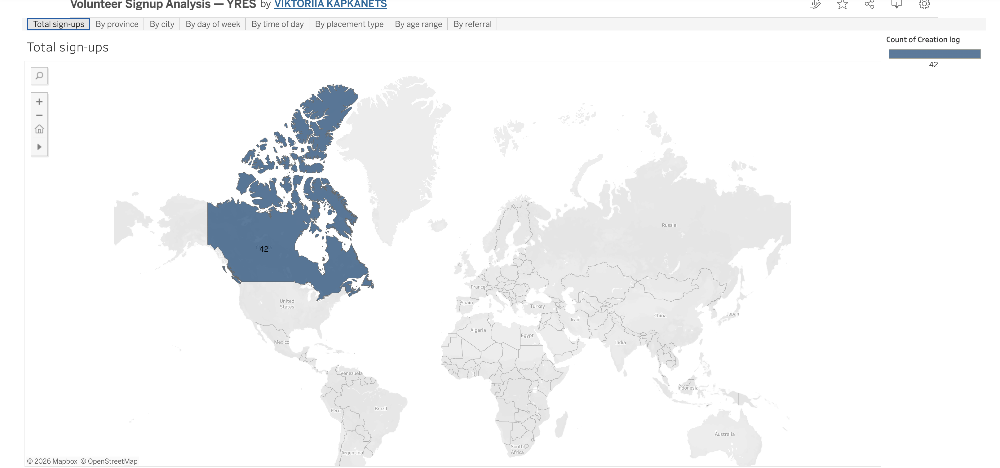
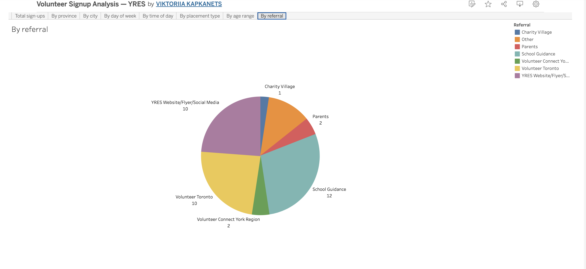
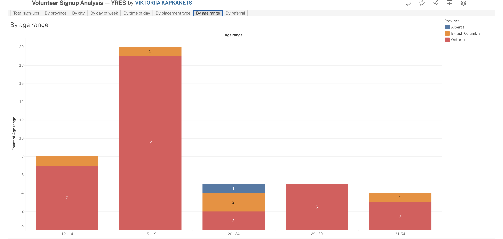
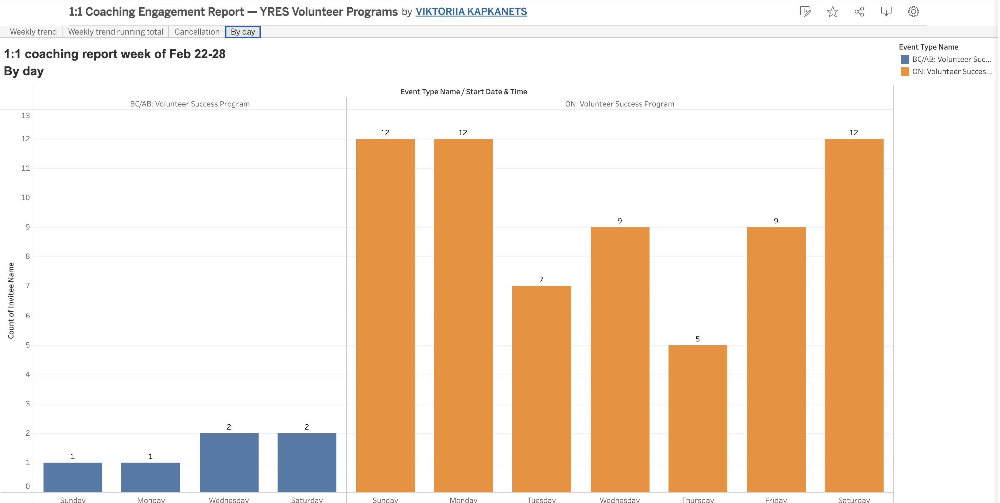
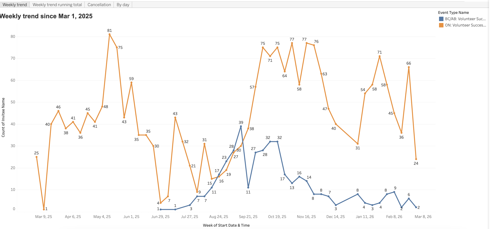

# YRES Signup & Coaching Analysis — Tableau

> Interactive Tableau dashboards built for YRES, a Canadian youth services nonprofit, analyzing volunteer signup patterns and 1:1 coaching engagement across BC/AB and ON regional programs.

**Part of a [multi-tool case study](../) — these are the deliverables built for YRES's weekly reporting workflow.**

---

## Why Tableau for this project

Tableau is the platform the YRES analytics team works in. When I pick up a weekly reporting task, Tableau is the default delivery tool, and the dashboards published here are the actual deliverables I produced for the organization between February 2026 and the present.

Tableau strengths leveraged here:

- **Multi-tab dashboard architecture** for navigating between analytical views in one workbook
- **Geographic mapping** with custom Canadian province/city role assignments
- **Calculated fields** for derived segmentation
- **Cross-tab filtering** so a selection in one view propagates across the dashboard

---

## Live dashboards

These are part of a recurring weekly reporting series. Sample weeks are published on Tableau Public:

📊 **[Volunteer Signup Analysis](https://public.tableau.com/app/profile/viktoriia.kapkanets/viz/2026-02-13Weekly_sing_up_report/Totalsign-ups)** — multi-dimensional view across geography, day of week, time of day, placement type, age range, and referral source.

📊 **[1:1 Coaching Engagement Report](https://public.tableau.com/app/profile/viktoriia.kapkanets/viz/Weekly11coachingreportFeb22-28/Byday)** — daily session tracking, weekly trends, running totals, and cancellation breakdowns across BC/AB and ON Volunteer Success Programs.

---

## Business questions

**Signup analysis:** Where are YRES volunteers coming from (geographic, demographic, referral), and when do they typically register? This informs recruitment channel investment and timing of outreach campaigns.

**Coaching engagement:** How is 1:1 coaching uptake trending across the two regional programs? Where are cancellations clustering, and what is the running cumulative engagement?

---

## Approach

Built end-to-end in Tableau Desktop:

- **Multi-tab dashboard architecture** — eight analytical views within a single workbook (Total sign-ups, By province, By city, By day of week, By time of day, By placement type, By age range, By referral). Coordinators navigate from high-level overview to detailed segmentation without switching files.
- **Geographic mapping** — Canadian province and city visualization using Tableau's geographic role assignments, with color-coding by province to distinguish regional patterns (BC/AB vs ON).
- **Calculated fields** — derived dimensions to support deeper segmentation analysis (grouping referral sources into categories, bucketing time-of-day).
- **Interactive filtering** — slicers and parameter actions that filter across multiple views simultaneously.

---

## Techniques demonstrated

- **Multi-tab dashboard design** — coherent navigation across eight analytical views in one workbook
- **Geographic visualization** — Canadian province and city maps with custom color encoding
- **Calculated fields** — derived dimensions for time-of-day, referral grouping, and segment categorization
- **Cross-program comparison** — side-by-side analysis of BC/AB and ON Volunteer Success Programs
- **Recurring reporting** — designed for weekly republishing with consistent structure

---

## Screenshots

### Signup Analysis

**Geographic distribution — Total sign-ups by country**

**Referral source breakdown**

**Age range distribution**

### Coaching Engagement Report

**Daily session counts by program**

**Weekly engagement trend**

---

## Tools

Tableau Desktop · Tableau Public · Calculated Fields · Geographic Role Assignments

---

## Data and privacy

Published with permission from YRES. No participant names, contact information, or identifying details are visible in any visualization.

---

**Author:** Viktoriia Kapkanets — Microsoft Certified Power BI Data Analyst (PL-300)
**Portfolio:** [GitHub](https://github.com/Viktoriia-Kapkanets) · [Tableau Public](https://public.tableau.com/app/profile/viktoriia.kapkanets) · [LinkedIn](https://www.linkedin.com/in/viktoriia-kapkanets/)
