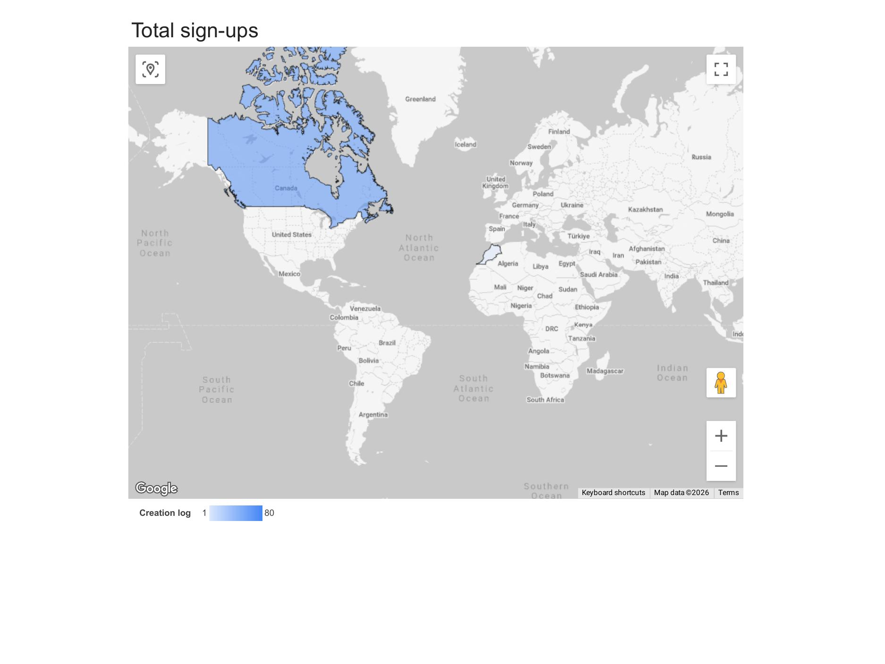
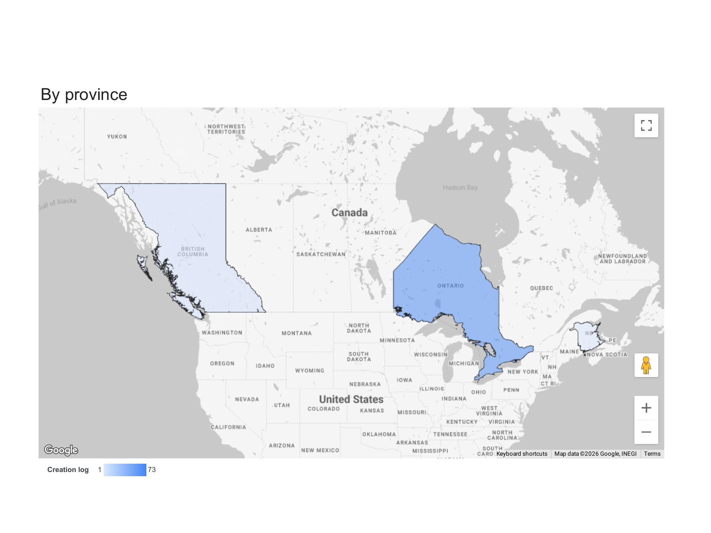
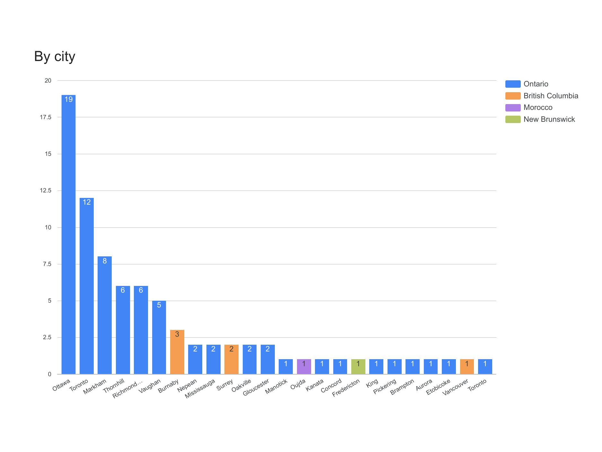
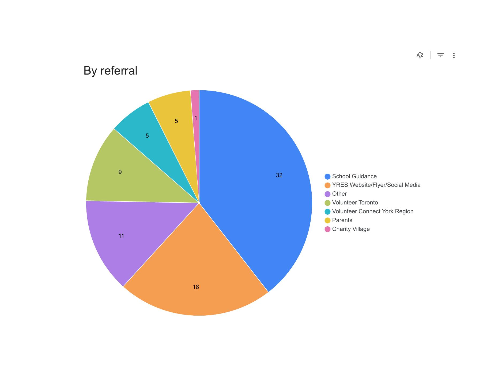

# YRES Weekly Signup Report — Looker Studio

> Weekly signup analysis built in Looker Studio using YRES data. A self-directed exploration of Looker Studio's strengths — lightweight, link-shareable reporting with live Google Sheets integration — on real production data with permission to publish.

**Part of a [multi-tool case study](https://github.com/Viktoriia-Kapkanets/YRES-data-analytics-portfolio)**

---

## Why Looker Studio here

After delivering YRES weekly reports in Tableau (the team's primary platform) and rebuilding the analysis in Power BI to deepen my PL-300 skills, I wanted to round out my BI toolkit by exploring Looker Studio on the same real-world data.

Looker Studio brings a different deployment model than Tableau or Power BI:

- **Zero-friction sharing** — anyone with the link can view in a browser, no account or license required
- **Live data refresh** — connected directly to Google Sheets source
- **Cost-free for any viewer** — no software licensing
- **Embeddable** — can be added to a website or partner report

These are real differentiators for stakeholder-facing dashboards, and this project demonstrates that I can produce a working Looker Studio report end-to-end, not just name-drop the tool on a resume.

---

## Live dashboard

📊 **[View the live report on Looker Studio →](https://datastudio.google.com/reporting/1f9f8e54-044c-40dc-aa7c-8cb35762da9e)**

---

## What the report shows

Seven analytical views of weekly volunteer signups (sample data from the week of March 6–12, 2026):

1. **Total sign-ups** — country-level geographic distribution (world map)
2. **By province** — Canadian province breakdown (Canada-focused map)
3. **By city** — top cities with province color-coding
4. **By day of week** — when in the week signups happen, stacked by province
5. **By time of day** — when in the day signups happen, stacked by province
6. **By placement type** — In-Person vs Virtual vs Flexible vs Hybrid breakdown
7. **By referral** — which channels bring volunteers (School Guidance, YRES Website, Volunteer Toronto, etc.)

---

## Approach

- **Data source** — connected directly to a Google Sheet containing weekly signup records derived from Calendly exports
- **Geographic mapping** — Google Maps integration for country and province visualizations
- **Color encoding** — consistent province color scheme across all charts (Ontario blue, BC orange) for visual continuity between views
- **Stacked bar charts** — show both totals and province segmentation in a single view
- **Single-page-per-view layout** — each analytical view on its own page, navigable through Looker Studio's page selector

---

## Screenshots

### Total sign-ups — world view

### By province — Canadian focus

### By city

### By referral source

---

## Tools

Looker Studio (formerly Google Data Studio) · Google Sheets · Google Maps integration

---

## Data and privacy

Built on YRES data with permission to publish. No participant names, contact information, or identifying details are visible in any visualization.

---

**Author:** Viktoriia Kapkanets — Microsoft Certified Power BI Data Analyst (PL-300)
**Portfolio:** [GitHub](https://github.com/Viktoriia-Kapkanets) · [Tableau Public](https://public.tableau.com/app/profile/viktoriia.kapkanets) · [LinkedIn](https://www.linkedin.com/in/viktoriia-kapkanets/)
